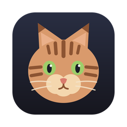
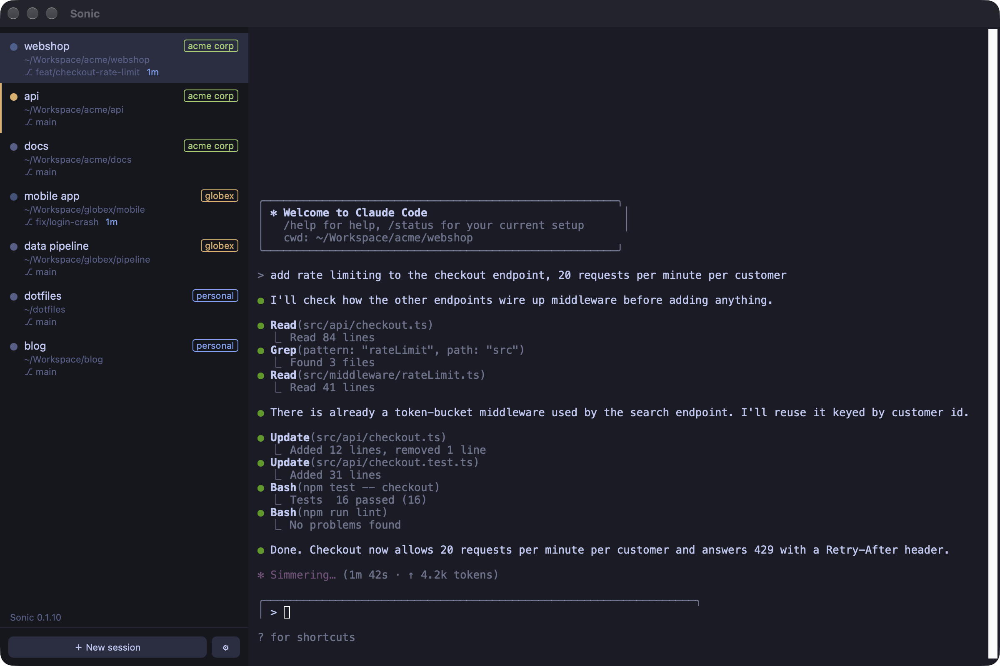

<p align="center">
  
</p>

<h1 align="center">Sonic</h1>

<p align="center">
  One window for all your Claude Code identities.<br>
  Projects in a sidebar, live status, isolated profiles per account or client.
</p>

<p align="center">
  
</p>

<p align="center">
  <a href="#how-it-works">How it works</a> ·
  <a href="#install">Install</a> ·
  <a href="#keyboard">Keyboard</a> ·
  <a href="#development">Development</a> ·
  <a href="#limitations">Limitations</a>
</p>

---

Sonic is a small macOS app for people who run [Claude Code](https://docs.anthropic.com/en/docs/claude-code) under
**several identities** — a private account, one per client, one per employer — each with its own
`CLAUDE_CONFIG_DIR`, its own login, and its own MCP servers. Instead of juggling shell aliases and
terminal tabs, you get:

- **A sidebar of every running project**, each with a status dot:
  grey *idle* · pulsing blue *working* · yellow *waiting for input* · red *exited*
- **`⌘N` to start a project**: pick a profile, pick a folder (recents or a native picker), go
- **Profiles managed in-app**: create an isolated profile and log in right there, or import the
  config dirs you already have
- **macOS notifications and a dock badge** when a terminal you're not looking at needs you
- **Resume on relaunch**: quit with projects open, and Sonic offers to pick each conversation up again

It is deliberately lean. No worktree orchestration, no agent teams, no task boards — just projects
and profiles.

## How it works

**Profiles.** A profile is a name plus a `CLAUDE_CONFIG_DIR`. *Managed* profiles live in Sonic's
data directory and are created by the app; *imported* profiles point at directories you already
use (for example `~/.claude-work`). Deleting a managed profile moves its directory to the Trash;
deleting an imported one never touches your files.

**Projects.** Each project is a folder row in the sidebar with one or more terminals (Claude or shell), each running on its own PTY rendered in an
[xterm.js](https://xtermjs.org/) pane, started in the project folder with the profile's
environment. Terminals are children of the app; when Sonic quits they end. Claude terminals
remember their conversation ids so they can be resumed; shells come back fresh.

- **Several terminals per project**: add a plain shell (`⌘T`) or a second Claude terminal (`⌘⇧T`)
  to any project. They run in the project folder with the profile's environment, show as
  indented rows, and cycle with `⌘⇧]` / `⌘⇧[`.

**Status.** Claude Code doesn't expose a status API, so Sonic uses its official
[hooks](https://docs.anthropic.com/en/docs/claude-code/hooks). On profile creation or import, three
hooks (`UserPromptSubmit` → working, `Notification` → waiting, `Stop` → idle) are **merged** into
the profile's `settings.json` — your existing hooks are kept, and the original file is backed up as
`settings.json.sonic-backup`. The hook script reports over a local unix socket and is a silent no-op
when the profile is used from a plain terminal, so nothing changes outside Sonic.

## Install

Sonic is macOS-only. It needs the `claude` CLI available in your login shell's `PATH` (or set its
path in Sonic's settings).

### Homebrew

```sh
brew trust --cask philippspinnler/tap/sonic   # Homebrew 6+ requires trusting third-party casks
brew install --cask philippspinnler/tap/sonic
```

Update later with `brew upgrade --cask sonic`.

Sonic isn't notarized with Apple (that requires a paid Developer ID), so macOS would normally
refuse to open a downloaded copy. The cask clears the quarantine flag after installing, so it
opens like any other app. If you copied the app manually instead and macOS calls it "damaged",
run this once:

```sh
xattr -cr /Applications/Sonic.app
```

### From source

Requirements: [Rust](https://rustup.rs/) (1.88+) and [Node.js](https://nodejs.org/) (20+).

```sh
git clone git@github.com:philippspinnler/sonic.git
cd sonic
npm install
npm run tauri build
```

The app bundle lands in `src-tauri/target/release/bundle/macos/Sonic.app` — drag it to
`/Applications`.

### First run

1. Open Settings (`⌘,`) and either **Import existing dir…** for each config directory you already
   use, or **New profile…** to create a fresh one (a terminal opens so you can run `/login` and set
   up MCP servers).
2. Press `⌘N`, pick a profile, pick a folder.

To import several existing directories at once from the command line:

```sh
cd src-tauri
cargo run --example import_profiles -- "private=$HOME/.claude-private" "work=$HOME/.claude-work"
```

## Keyboard

| Shortcut | Action |
|---|---|
| `⌘N` | New project (profile → folder), opens with its Claude terminal |
| `⌘T` | New shell in the selected project |
| `⌘⇧T` | New Claude terminal in the selected project |
| `⌘W` | Close the selected terminal (asks first if it's working); the last one closes the project |
| `⌘⇧W` | Close the selected project |
| `⌘1` … `⌘9` | Jump to the n-th project |
| `⌘⇧]` / `⌘⇧[` | Next / previous terminal in the project |
| `⌘F` | Find in the terminal |
| `⌘,` | Settings: profiles, `claude` binary path, notifications |
| double-click a name | Rename the project or terminal |

Drag the sidebar's right edge to resize it.

## Development

```sh
npm install
npm run tauri dev          # app with hot reload

cargo test --manifest-path src-tauri/Cargo.toml   # Rust: state, profiles, hooks, PTY, socket
npm test                                          # frontend store logic
```

The Rust core (`src-tauri/src/`) owns all state: `profiles.rs` (registry), `hooks.rs`
(settings.json merge), `sessions.rs` (PTY spawn), `status.rs` (socket listener), `state_store.rs`
(persistence), `commands.rs` (Tauri IPC). The frontend (`src/`) is plain TypeScript with xterm.js —
no framework. Design notes are in `docs/`.

Sonic never modifies Claude Code itself; it only uses environment variables, hooks, and
`claude --resume`.

### Releasing

Bump `version` in `package.json` and `src-tauri/tauri.conf.json`, then:

```sh
npm run tauri build
ditto -c -k --keepParent src-tauri/target/release/bundle/macos/Sonic.app release/Sonic-X.Y.Z.zip
gh release create vX.Y.Z release/Sonic-X.Y.Z.zip --title "Sonic X.Y.Z"
shasum -a 256 release/Sonic-X.Y.Z.zip   # paste into Casks/sonic.rb in philippspinnler/homebrew-tap
```

## Limitations

- macOS only (uses `nc -U`, Trash, the dock badge, and `open`).
- Sessions don't survive the app quitting; use resume-on-relaunch instead.
- Not affiliated with Anthropic.

## Name

Named after a tabby cat.
